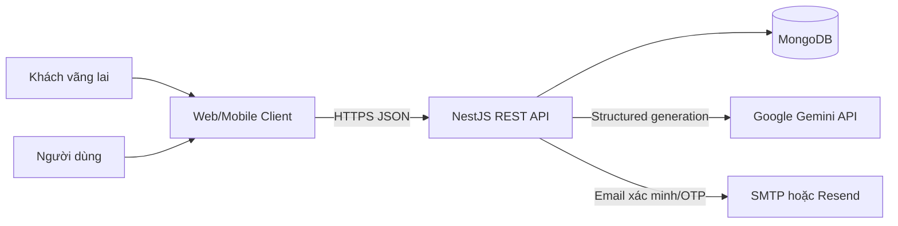
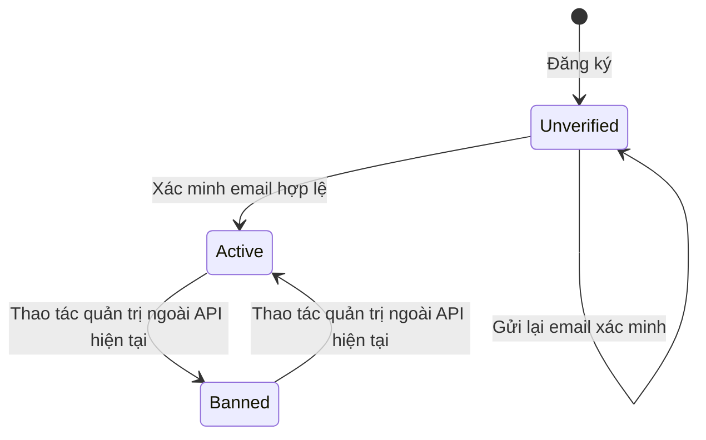
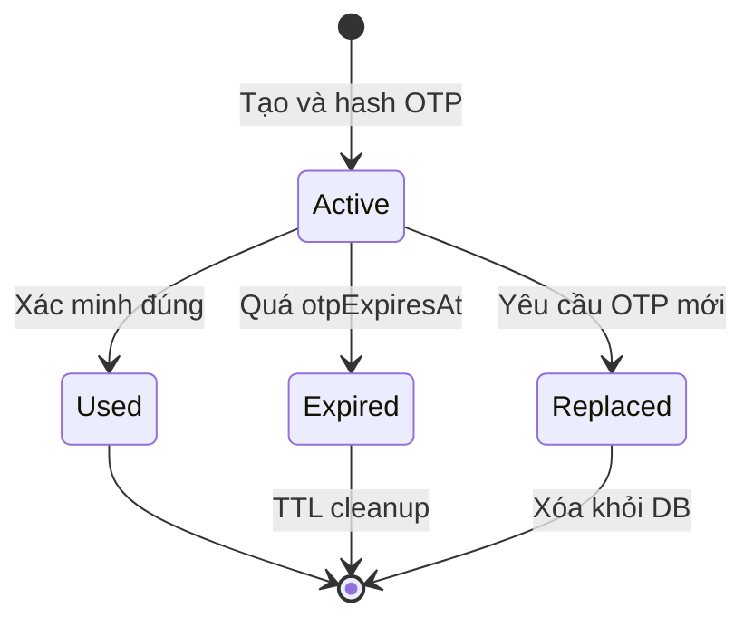
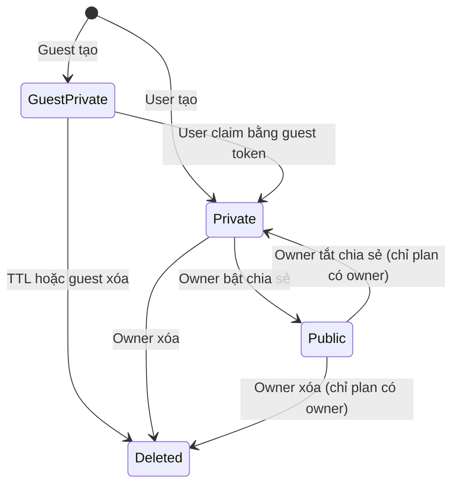

# Software Requirements Specification (SRS)

## AI Travel & Outing Planner Backend

| Thuộc tính     | Giá trị                    |
| -------------- | -------------------------- |
| Phiên bản      | 1.0                        |
| Trạng thái     | As-built specification     |
| Ngày cập nhật  | 20/08/2026                 |
| Hệ thống       | `ai-travel-planner-server` |
| API base path  | `/api/v1`                  |
| Tài liệu nguồn | [PRD](./PRD.md)            |

## 1. Giới thiệu

### 1.1. Mục đích

Tài liệu này đặc tả yêu cầu phần mềm của backend AI Travel & Outing Planner. Tài liệu là baseline chung để:

- Developer hiểu hành vi phải duy trì khi sửa hoặc mở rộng hệ thống.
- QA xây dựng test case và xác định kết quả mong đợi.
- Product Owner đối chiếu yêu cầu nghiệp vụ với chức năng đã triển khai.
- DevOps cấu hình, triển khai và giám sát dịch vụ.

### 1.2. Phạm vi

Hệ thống là REST API cung cấp:

- Quản lý danh tính và phiên đăng nhập.
- Xác minh email và khôi phục mật khẩu.
- Quản lý hồ sơ người dùng.
- Sinh kế hoạch du lịch bằng Google Gemini.
- Lưu trữ, phân trang, phân quyền, chia sẻ và xóa kế hoạch.
- Health check, validation, rate limiting, CORS và logging.

### 1.3. Quy ước từ khóa

- **Phải**: yêu cầu bắt buộc.
- **Nên**: yêu cầu khuyến nghị, có thể hoãn nếu có lý do.
- **Có thể**: tùy chọn.
- **Anonymous/Guest**: request không có access token.
- **Authenticated user**: user có access token hợp lệ.
- **Owner**: user có `_id` trùng `userId` của kế hoạch.
- **Access token**: JWT dùng truy cập API bảo vệ.
- **Refresh token**: JWT dùng cấp access token mới hoặc đăng xuất.

### 1.4. Tài liệu tham chiếu

- [PRD](./PRD.md)
- [API Documentation](./API.md)
- [Project Structure](./STRUCTURE.md)
- [Environment Configuration](../.env.example)

## 2. Mô tả tổng thể

### 2.1. Ngữ cảnh hệ thống



### 2.2. Kiến trúc logic

| Lớp/module          | Trách nhiệm                                                                      |
| ------------------- | -------------------------------------------------------------------------------- |
| `AppModule`         | Cấu hình, MongoDB, throttling, module composition                                |
| `AuthModule`        | Controller auth, Passport guards/strategies, token, verification, password reset |
| `UsersModule`       | Truy cập và thao tác dữ liệu user                                                |
| `OtpModule`         | Tạo, hash, xác minh và tiêu thụ OTP                                              |
| `TripPlannerModule` | Sinh, lưu, truy xuất và phân quyền kế hoạch                                      |
| `MailModule`        | Gửi email qua Resend HTTP hoặc SMTP                                              |
| `GeminiAiService`   | Gọi Gemini, parse và kiểm tra kết quả                                            |
| `BaseRepository`    | Các thao tác MongoDB dùng chung                                                  |

### 2.3. Tác nhân

| Tác nhân           | Mô tả                                                                    |
| ------------------ | ------------------------------------------------------------------------ |
| Guest              | Tạo và xem kế hoạch công khai không cần tài khoản                        |
| User chưa xác minh | Đã đăng ký nhưng chỉ có thể xác minh/gửi lại email; không đăng nhập được |
| User hoạt động     | Có thể sử dụng toàn bộ chức năng cá nhân                                 |
| User bị khóa       | Bị từ chối khi đăng nhập hoặc dùng token                                 |
| Gemini API         | Sinh kế hoạch có cấu trúc                                                |
| Mail provider      | Chuyển email xác minh và OTP                                             |
| MongoDB            | Lưu user, OTP và trip plan                                               |
| CI runner          | Chạy lint, test và build                                                 |

### 2.4. Ma trận quyền truy cập

| Chức năng                   |         Guest |              User chưa xác minh |                       User hoạt động | Owner |
| --------------------------- | ------------: | ------------------------------: | -----------------------------------: | ----: |
| Đăng ký                     |            Có |                              Có |                                   Có |    Có |
| Xác minh/gửi lại email      |            Có |                              Có | Có, nhưng resend không tạo email mới |    Có |
| Đăng nhập                   | Không áp dụng |                      Bị từ chối |                                   Có |    Có |
| Tạo kế hoạch                |            Có | Có như guest nếu không có token |                                   Có |    Có |
| Xem danh sách công khai     |            Có |                              Có |                                   Có |    Có |
| Xem kế hoạch công khai      |            Có |                              Có |                                   Có |    Có |
| Xem kế hoạch riêng tư       |         Không |                           Không |                Chỉ kế hoạch của mình |    Có |
| Lịch sử cá nhân             |         Không |                           Không |                                   Có |    Có |
| Chia sẻ/xóa kế hoạch        |         Không |                           Không |                Chỉ kế hoạch của mình |    Có |
| Profile/đổi mật khẩu/logout |         Không |                           Không |                                   Có |    Có |

## 3. Yêu cầu chức năng

### 3.1. Đăng ký và xác minh email

#### FR-AUTH-001 – Đăng ký tài khoản

- Endpoint: `POST /api/v1/auth/register`.
- Hệ thống phải nhận `email`, `username`, `password`, `name`.
- Hệ thống phải chuẩn hóa email về chữ thường và loại bỏ khoảng trắng hai đầu.
- Hệ thống phải từ chối email hoặc username đã tồn tại với HTTP 409.
- Hệ thống phải hash mật khẩu bằng bcrypt trước khi lưu.
- Tài khoản mới phải có `isActive = false`, `isBanned = false`, `role = user`.
- Hệ thống phải tạo yêu cầu xác minh email sau khi tạo user.
- Response 201 không được chứa access token, refresh token hoặc password.

Điều kiện lỗi:

- Payload sai định dạng: 400.
- Email/username trùng: 409.
- Lỗi lưu dữ liệu: 500.

#### FR-AUTH-002 – Gửi email xác minh

- Hệ thống phải tạo `jti` ngẫu nhiên cho mỗi lần gửi.
- Hệ thống phải lưu bản bcrypt hash của `jti` vào user.
- Hệ thống phải phát hành JWT loại `email_verify` chứa `sub` và `jti`.
- Thời hạn mặc định của token là 15 phút nếu không cấu hình.
- URL phải có dạng `{BACKEND_BASE_URL}/api/v1/auth/verify-email?token=...`.
- Hệ thống phải gửi email qua Resend nếu có `RESEND_API_KEY`; nếu không thì dùng SMTP.
- Lỗi gửi email không được rollback tài khoản đã tạo.

#### FR-AUTH-003 – Xác minh email

- Endpoint: `GET /api/v1/auth/verify-email?token=<token>`.
- Hệ thống phải kiểm tra chữ ký, hạn dùng và `type = email_verify`.
- Hệ thống phải so sánh `jti` với bản hash đang lưu.
- Hệ thống phải cập nhật `isActive = true`, `emailVerifiedAt` và xóa `verifyJti` trong một điều kiện chống race condition.
- Token đã dùng, token cũ sau resend hoặc token sai phải trả 400.

#### FR-AUTH-004 – Gửi lại email xác minh

- Endpoint: `POST /api/v1/auth/resend-verification`.
- Nếu email tồn tại và user chưa active, hệ thống phải tạo token mới.
- Nếu email không tồn tại hoặc đã active, hệ thống không gửi email.
- Response phải luôn là 202 với thông báo trung tính để chống dò email.
- Token xác minh cũ phải mất hiệu lực sau khi token mới được lưu.

### 3.2. Đăng nhập và quản lý token

#### FR-AUTH-005 – Đăng nhập

- Endpoint: `POST /api/v1/auth/login`.
- Hệ thống phải xác minh email và mật khẩu.
- Tài khoản chưa active hoặc bị khóa phải bị từ chối.
- Hệ thống phải tạo refresh token chứa `sub`, `type = refresh`, `tokenVersion`, `role`.
- Hệ thống phải lưu bản bcrypt hash của refresh token.
- Hệ thống phải tạo access token chứa `sub`, `email`, `type = accessToken`, `role`, `tokenVersion`.
- Response 200 phải có `access_token`, `refresh_token` và thông tin user an toàn.
- Mặc định access token hết hạn sau 15 phút, refresh token sau 7 ngày.

#### FR-AUTH-006 – Làm mới access token

- Endpoint: `POST /api/v1/auth/refresh`.
- Header phải chứa `Authorization: Bearer <refresh_token>`.
- Hệ thống phải kiểm tra chữ ký, hạn dùng, token type, trạng thái user và `tokenVersion`.
- Token gốc phải khớp bản hash trong database.
- Nếu hợp lệ, response 200 trả access token mới.
- Hệ thống không phát hành refresh token mới trong thao tác này.

#### FR-AUTH-007 – Thu hồi token

- Khi logout, đổi mật khẩu hoặc reset mật khẩu, hệ thống phải tăng `refreshTokenVersion`.
- Access/refresh token có version cũ phải bị từ chối ở lần sử dụng tiếp theo.
- Khi logout hoặc thay đổi mật khẩu, refresh token đã lưu phải bị xóa.

#### FR-AUTH-008 – Đăng xuất

- Endpoint: `DELETE /api/v1/auth/logout`.
- Header phải chứa refresh token.
- Hệ thống chỉ xử lý nếu refresh token hợp lệ.
- Hệ thống phải xóa refresh token đã lưu và tăng token version.
- Nếu không có refresh token lưu trong DB, trả 401.

### 3.3. Hồ sơ và mật khẩu

#### FR-USER-001 – Xem hồ sơ

- Endpoint: `GET /api/v1/auth/profile`.
- Yêu cầu access token hợp lệ.
- Response không được chứa password, refresh token, verify JTI hoặc dữ liệu xác thực nội bộ.

#### FR-USER-002 – Cập nhật hồ sơ

- Endpoint: `PATCH /api/v1/auth/profile`.
- Chỉ cho phép cập nhật `gender`, `phone`, `name`, `avatarUrl`, `bio`, `birthDate`.
- Global validation phải loại hoặc từ chối trường không có trong DTO.
- Chỉ trường xuất hiện trong payload mới được cập nhật.
- Email, username, role và trạng thái tài khoản không được cập nhật qua endpoint này.

Ràng buộc:

| Trường      | Ràng buộc                                                             |
| ----------- | --------------------------------------------------------------------- |
| `gender`    | `male` hoặc `female`                                                  |
| `phone`     | 7–20 ký tự, chỉ số và các ký tự `+`, khoảng trắng, `()`, `.` hoặc `-` |
| `name`      | Chuỗi, tối đa 50 ký tự                                                |
| `avatarUrl` | URL có protocol                                                       |
| `bio`       | Chuỗi, tối đa 500 ký tự                                               |
| `birthDate` | Chuỗi ngày ISO hợp lệ                                                 |

#### FR-USER-003 – Đổi mật khẩu khi đăng nhập

- Endpoint: `PATCH /api/v1/auth/change-password`.
- Yêu cầu access token.
- `oldPassword` phải khớp mật khẩu hiện tại.
- `newPassword` phải bằng `confirmPassword`.
- Các trường mật khẩu phải dài 8–20 ký tự.
- Sau khi đổi thành công, hệ thống phải thu hồi toàn bộ token cũ.

### 3.4. Quên và reset mật khẩu

#### FR-RESET-001 – Yêu cầu OTP

- Endpoint: `POST /api/v1/auth/forgot-password`.
- Hệ thống phải luôn trả 202 với thông báo trung tính.
- Nếu user không tồn tại, hệ thống không tạo OTP và không gửi email.
- Nếu user tồn tại, hệ thống phải tạo OTP ngẫu nhiên từ 100000 đến 999999.
- OTP phải được bcrypt hash trước khi lưu.
- OTP chưa dùng trước đó của cùng user và purpose phải bị xóa.
- Thời hạn mặc định là 5 phút.

#### FR-RESET-002 – Xác minh OTP

- Endpoint: `POST /api/v1/auth/forgot-password-verify`.
- `otpCode` phải gồm đúng sáu chữ số.
- Hệ thống chỉ lấy OTP mới nhất, chưa dùng và chưa hết hạn.
- OTP hợp lệ phải được đánh dấu `used = true` theo điều kiện atomic.
- Response 200 phải trả `reset_token`.
- OTP sai, hết hạn hoặc đã dùng phải trả 400 với thông báo không phân biệt nguyên nhân.

#### FR-RESET-003 – Reset mật khẩu

- Endpoint: `PATCH /api/v1/auth/change-password-forgot`.
- Reset token phải có `type = password_reset`, còn hạn và có version hiện hành.
- `newPassword` phải bằng `confirmPassword` và dài 8–20 ký tự.
- Sau đổi mật khẩu, hệ thống phải tăng token version và xóa refresh token.
- Reset token không thể dùng lần hai vì token version đã thay đổi.

### 3.5. Sinh kế hoạch du lịch

#### FR-TRIP-001 – Nhận tiêu chí lập kế hoạch

- Endpoint: `POST /api/v1/trip-planner/generate`.
- Access token là tùy chọn. Nếu header Authorization tồn tại nhưng token sai, request phải bị từ chối thay vì xử lý như guest.
- Payload phải tuân theo bảng sau.

| Trường                     | Bắt buộc | Kiểu/giới hạn                                  | Mặc định            |
| -------------------------- | -------: | ---------------------------------------------- | ------------------- |
| `budget`                   |       Có | Number, 100.000–1.000.000.000                  | Không               |
| `budgetType`               |    Không | `total` hoặc `per_person`                      | `total`             |
| `numberOfPeople`           |       Có | Integer/number, 1–100                          | Không               |
| `originLocation`           |       Có | String, tối đa 100                             | Không               |
| `destinationPreference`    |    Không | String, tối đa 100                             | AI tự chọn          |
| `tripStyles`               |    Không | Array tối đa 10 phần tử, mỗi phần tử tối đa 50 | Nghỉ dưỡng, Ẩm thực |
| `days`                     |       Có | Number, 1–14                                   | Không               |
| `nights`                   |    Không | Number, 0–14                                   | `max(0, days - 1)`  |
| `transportationPreference` |    Không | String, tối đa 100                             | Phù hợp nhất        |
| `specialNotes`             |    Không | String, tối đa 1.000                           | Không có            |

#### FR-TRIP-002 – Quy đổi ngân sách

- Nếu `budgetType = total`, tổng ngân sách bằng `budget`.
- Nếu `budgetType = per_person`, tổng ngân sách bằng `budget × numberOfPeople`.
- Prompt phải nêu tổng ngân sách đoàn và ngân sách trên mỗi người.

#### FR-TRIP-003 – Gọi Gemini structured output

- Model mặc định là `gemini-3.5-flash-lite`, có thể thay bằng `GEMINI_MODEL`.
- Request phải dùng `responseMimeType = application/json`.
- Request phải cung cấp JSON Schema cho toàn bộ kết quả.
- Prompt hệ thống phải yêu cầu phân bổ chi phí, lịch trình hợp lý và không vượt ngân sách.
- Nếu không có `GEMINI_API_KEY`, endpoint phải trả lỗi 500 rõ ràng.

#### FR-TRIP-004 – Cấu trúc kết quả

Kết quả phải gồm:

- `destination`: tên, tagline, lý do và mùa phù hợp tùy chọn.
- `budgetBreakdown`: tổng, trên mỗi người, di chuyển, lưu trú, ăn uống, vé/vui chơi, dự phòng và tiền tệ.
- `itinerary`: danh sách ngày; mỗi ngày có tiêu đề và ba buổi sáng/chiều/tối.
- Mỗi buổi có thời gian, hoạt động, địa điểm, chi phí và ghi chú tùy chọn.
- `recommendedSpots.foodAndDrink`: tên, loại, món nên thử, khoảng giá và địa chỉ/khu vực.
- `recommendedSpots.attractions`: tên, loại, điểm nổi bật, giá vé và thời gian phù hợp tùy chọn.
- `travelTips`: danh sách lưu ý.

#### FR-TRIP-005 – Kiểm tra kết quả AI

- JSON phải parse được.
- Phải có `destination.name` và `budgetBreakdown`.
- Số ngày trong itinerary phải đúng `days`.
- `totalEstimated` phải hữu hạn, không âm và không vượt tổng ngân sách.
- Kết quả không đạt phải không được lưu và API trả 500.

#### FR-TRIP-006 – Lưu kế hoạch

- Hệ thống phải lưu `inputCriteria` và toàn bộ kết quả AI.
- Nếu request có user hợp lệ: lưu ObjectId user và `isPublic = false`.
- Nếu request là guest: lưu `userId = null`, `isPublic = false`, guest token dạng hash và `expiresAt`.
- Guest token gốc chỉ trả một lần trong response; plan guest có thể được claim vào tài khoản.
- Response mặc định của Mongoose không được để lộ `userId`.

### 3.6. Truy xuất và quản lý kế hoạch

#### FR-TRIP-007 – Lịch sử cá nhân

- Endpoint: `GET /api/v1/trip-planner/my-trips?page=1&limit=10`.
- Yêu cầu access token.
- Chỉ trả kế hoạch có `userId` bằng user hiện tại.
- Sắp xếp mới nhất trước.
- Response gồm `data`, `total`, `page`, `limit`, `totalPages`.

#### FR-TRIP-008 – Danh sách công khai

- Endpoint: `GET /api/v1/trip-planner/public?page=1&limit=10`.
- Không yêu cầu xác thực.
- Chỉ trả kế hoạch có `isPublic = true`.
- Sắp xếp mới nhất trước và trả metadata phân trang.

#### FR-TRIP-009 – Quy tắc phân trang

- `page` mặc định 1 và tối thiểu 1.
- `limit` mặc định 10, tối thiểu 1 và tối đa 50.
- Giá trị query phải được chuyển sang Number.

#### FR-TRIP-010 – Xem chi tiết

- Endpoint: `GET /api/v1/trip-planner/:id`.
- Access token là tùy chọn.
- ID không đúng ObjectId hoặc không tồn tại trả 404.
- Kế hoạch công khai được trả cho mọi tác nhân.
- Kế hoạch riêng tư chỉ được trả nếu user hiện tại là owner hoặc guest token hợp lệ; trường hợp khác trả 403.

#### FR-TRIP-011 – Bật/tắt chia sẻ

- Endpoint: `PATCH /api/v1/trip-planner/:id/share`.
- Yêu cầu access token.
- Chỉ owner được thay đổi.
- Mỗi lần gọi phải đảo giá trị `isPublic`.
- Response phải trả trạng thái mới và nội dung kế hoạch.

#### FR-TRIP-012 – Xóa kế hoạch

- Endpoint: `DELETE /api/v1/trip-planner/:id`.
- Owner dùng access token; guest dùng `X-Guest-Token`.
- Chỉ owner hoặc người giữ guest token hợp lệ được xóa.

#### FR-TRIP-013 – Claim và quota guest

- `POST /api/v1/trip-planner/:id/claim` yêu cầu access token và guest token hợp lệ.
- Claim phải chuyển ownership sang user, gỡ TTL và vô hiệu guest token.
- `GET /api/v1/trip-planner/quota` trả lượt đã dùng, còn lại và thời gian reset.
- Quota theo ngày phải lưu trong MongoDB theo định danh user hoặc IP đã HMAC, không lưu IP gốc.
- ID sai hoặc plan không tồn tại trả 404; không phải owner trả 403.
- Xóa thành công trả thông báo xác nhận.

### 3.7. Health check và vận hành

#### FR-SYS-001 – API index

- Endpoint: `GET /api/v1`.
- Response phải liệt kê các endpoint chính để hỗ trợ kiểm tra thủ công.

#### FR-SYS-002 – Health check

- Endpoint: `GET /api/v1/health`.
- Response phải gồm:
  - `status`: `ok` nếu MongoDB connected, ngược lại `degraded`.
  - `database`: `connected` hoặc `disconnected`.
  - `ai`: `configured` hoặc `not_configured`.
  - `timestamp`: ISO datetime.
- Health check không thực hiện request thật đến Gemini.

## 4. Giao diện bên ngoài

### 4.1. Giao diện HTTP

- Protocol production: HTTPS.
- Kiểu dữ liệu request/response: JSON, ngoại trừ API index trả HTML string.
- Prefix: `/api/v1`.
- Bearer token truyền trong header `Authorization`.
- Global validation:
  - `whitelist = true`.
  - `forbidNonWhitelisted = true`.
  - `transform = true`.

### 4.2. Quy ước HTTP status

| Status | Ý nghĩa sử dụng                                                   |
| -----: | ----------------------------------------------------------------- |
|    200 | Đọc/cập nhật/xác minh/đăng nhập thành công                        |
|    201 | Đăng ký hoặc tạo tài nguyên thành công                            |
|    202 | Yêu cầu email/OTP được tiếp nhận, không tiết lộ account existence |
|    400 | Dữ liệu sai, token nghiệp vụ sai/hết hạn, tài khoản chưa active   |
|    401 | Thiếu/sai/hết hạn/revoked access hoặc refresh token               |
|    403 | Có danh tính nhưng không có quyền trên trip plan                  |
|    404 | Trip plan/ID không tồn tại hoặc không hợp lệ                      |
|    409 | Email hoặc username đã tồn tại                                    |
|    429 | Vượt rate limit                                                   |
|    500 | Lỗi DB, mail, cấu hình, Gemini hoặc kết quả AI không hợp lệ       |

### 4.3. Google Gemini

- SDK: `@google/genai`.
- Input: system instruction, user prompt và response schema.
- Output mong đợi: JSON text.
- Hệ thống phải parse và validate trước khi lưu.
- Hệ thống chưa có grounding, search, retry hoặc fallback model.

### 4.4. Email

Thứ tự chọn provider:

1. Nếu có `RESEND_API_KEY`, gọi `https://api.resend.com/emails`.
2. Nếu không, dùng Nodemailer SMTP với `MAIL_HOST`, `MAIL_PORT`, `MAIL_USER`, `MAIL_PASS`.
3. `MAIL_FROM` là bắt buộc khi gửi.

Nội dung HTML phải escape tên, URL và OTP trước khi chèn.

### 4.5. MongoDB

- Driver/ODM: Mongoose.
- Connection string: `MONGODB_URI`.
- Các collection logic: users, otps, tripplans.
- Mongoose timestamps phải tạo `createdAt` và `updatedAt`.

## 5. Mô hình dữ liệu

### 5.1. User

| Trường                | Kiểu        | Bắt buộc/mặc định   | Bảo mật/ý nghĩa                             |
| --------------------- | ----------- | ------------------- | ------------------------------------------- |
| `_id`                 | ObjectId    | Tự sinh             | ID user                                     |
| `email`               | String      | Required, unique    | Lowercase, trim                             |
| `password`            | String      | Required            | Bcrypt, `select: false`                     |
| `username`            | String      | Required, unique    | Trim                                        |
| `role`                | Enum        | `user`              | `user`/`admin`                              |
| `name`                | String      | Optional tại schema | Tên hiển thị                                |
| `phone`               | String      | Optional            | Số điện thoại                               |
| `avatarUrl`           | String      | Optional            | URL ảnh đại diện                            |
| `bio`                 | String      | Optional            | Giới thiệu                                  |
| `gender`              | Enum        | Optional            | `male`/`female`                             |
| `birthDate`           | String      | Optional            | Ngày ISO từ API                             |
| `authProvider`        | String      | `local`             | `select: false`                             |
| `lastLogin`           | Date        | Optional            | Chưa được cập nhật trong phiên bản hiện tại |
| `isActive`            | Boolean     | `false`             | Trạng thái xác minh email                   |
| `refreshToken`        | String      | Optional            | Bcrypt, `select: false`                     |
| `refreshTokenVersion` | Number      | `0`                 | Thu hồi access/refresh/reset token          |
| `isBanned`            | Boolean     | `false`             | Khóa truy cập                               |
| `emailVerifiedAt`     | Date/null   | `null`              | Thời điểm xác minh                          |
| `verifyJti`           | String/null | `null`              | Bcrypt hash của token xác minh hiện hành    |

### 5.2. OTP

| Trường                   | Kiểu     | Ý nghĩa                              |
| ------------------------ | -------- | ------------------------------------ |
| `_id`                    | ObjectId | ID OTP                               |
| `userId`                 | String   | ID user                              |
| `otpCode`                | String   | Bcrypt hash, không lưu OTP gốc       |
| `otpExpiresAt`           | Date     | Thời điểm hết hạn                    |
| `purpose`                | Enum     | `forgot_password` hoặc `reset_phone` |
| `used`                   | Boolean  | Đã tiêu thụ hay chưa                 |
| `createdAt`, `updatedAt` | Date     | Timestamps                           |

Index:

- TTL index trên `otpExpiresAt` với `expireAfterSeconds = 0`.
- Compound index `{ userId, purpose, createdAt: -1 }`.

### 5.3. TripPlan

| Trường                   | Kiểu          | Ý nghĩa                   |
| ------------------------ | ------------- | ------------------------- |
| `_id`                    | ObjectId      | ID kế hoạch               |
| `userId`                 | ObjectId/null | Owner; null đối với guest |
| `guestTokenHash`         | String        | Hash token quản lý guest  |
| `expiresAt`              | Date/null     | TTL chỉ cho guest plan    |
| `inputCriteria`          | Object        | Tiêu chí đầu vào          |
| `destination`            | Object        | Điểm đến AI đề xuất       |
| `budgetBreakdown`        | Object        | Phân bổ chi phí           |
| `itinerary`              | Array         | Lịch trình từng ngày      |
| `recommendedSpots`       | Object        | Ăn uống và tham quan      |
| `travelTips`             | String[]      | Lưu ý                     |
| `isPublic`               | Boolean       | Trạng thái chia sẻ        |
| `createdAt`, `updatedAt` | Date          | Timestamps                |

Index:

- `{ userId: 1, createdAt: -1 }`.
- `{ isPublic: 1, createdAt: -1 }`.
- TTL `{ expiresAt: 1 }` với `expireAfterSeconds = 0`.

Serialization phải xóa `userId` khỏi JSON response.

## 6. Trạng thái và vòng đời

### 6.1. Trạng thái tài khoản



### 6.2. Trạng thái OTP



### 6.3. Trạng thái kế hoạch



## 7. Bảo mật

### SEC-001 – Mật khẩu và secret

- Password, refresh token, OTP và verify JTI phải được bcrypt hash.
- JWT secret không được commit vào repository.
- `.env` phải bị loại khỏi Docker context và Git.
- Production phải dùng secret đủ mạnh và khác nhau theo mục đích.

### SEC-002 – Token isolation

- Access, refresh, email verify và password reset phải có `type` khác nhau.
- Strategy/verification phải từ chối token sai type dù chữ ký hợp lệ.
- Email verify dùng secret riêng.
- Reset password ưu tiên secret riêng, fallback sang access secret nếu thiếu.

### SEC-003 – Chống account enumeration

- Forgot password và resend verification phải trả response trung tính.
- Login có thể trả lỗi email/mật khẩu chung, không xác nhận riêng trường nào sai.

### SEC-004 – Authorization

- Mọi thao tác profile phải dùng access token.
- Refresh/logout phải dùng refresh token.
- Chia sẻ/xóa/private view phải kiểm tra ownership phía server.
- Không được tin `userId` do client gửi trong body/query.

### SEC-005 – Input validation

- DTO whitelist phải bật toàn hệ thống.
- Trường ngoài DTO phải bị từ chối.
- ID MongoDB phải được kiểm tra trước truy vấn trip plan.
- HTML email phải escape dữ liệu động.

### SEC-006 – CORS

- Development có thể cho phép reflected origin khi chưa có `FRONTEND_URL`.
- Production bắt buộc cấu hình `FRONTEND_URL`.
- Credentials được bật; chỉ các method/header khai báo được cho phép.

### SEC-007 – Rate limiting

Rate limit áp dụng toàn cục theo cấu hình mặc định và override các endpoint nhạy cảm:

| Endpoint            | Limit |  Window | Block duration |
| ------------------- | ----: | ------: | -------------: |
| Login               |    10 |  1 phút |         5 phút |
| Register            |     3 |  1 phút |         5 phút |
| Update profile      |   120 |  1 phút |         1 phút |
| Forgot password     |     3 |  5 phút |         5 phút |
| Change password     |     3 | 15 phút |        15 phút |
| Reset password      |     5 | 15 phút |        15 phút |
| Verify forgot OTP   |     5 | 15 phút |        15 phút |
| Resend verification |     3 | 15 phút |        15 phút |
| Generate trip       |     5 |  1 phút |         5 phút |

Giới hạn mặc định: `RATE_LIMIT_DEFAULT_LIMIT` request trong `RATE_LIMIT_DEFAULT_TTL` phút; fallback 60 request/phút.

## 8. Yêu cầu phi chức năng

### NFR-001 – Hiệu năng

- API không gọi bên thứ ba nên đạt P95 ≤ 1 giây trong điều kiện tải bình thường và DB cùng khu vực.
- Generate trip nên đạt P95 ≤ 30 giây; thời gian thực phụ thuộc Gemini.
- Danh sách phải phân trang, không trả quá 50 phần tử/request.
- Các danh sách phải dùng index phù hợp với filter và sort.

### NFR-002 – Khả dụng và phục hồi

- Health endpoint phải phản ánh trạng thái MongoDB.
- Lỗi Gemini/email không được làm crash tiến trình.
- Lỗi generate không được tạo bản ghi kế hoạch không hoàn chỉnh.
- Phiên bản hiện tại chưa có retry/circuit breaker; đây là cải tiến bắt buộc trước SLA cao.

### NFR-003 – Tính toàn vẹn dữ liệu

- Email/username có unique index.
- OTP và verify token phải tiêu thụ một lần bằng điều kiện cập nhật atomic.
- Token version phải ngăn reuse reset token và token cũ.
- Kế hoạch chỉ được lưu sau khi kết quả AI qua validation.

### NFR-004 – Khả năng bảo trì

- TypeScript phải build không lỗi.
- Code phải qua ESLint và Prettier.
- Auth phải tách token, verification và password reset thành service độc lập.
- Prompt và response schema không nằm chung trong hàm gọi Gemini.
- Repository dùng type Mongoose rõ ràng, không dùng `any` trong production code.

### NFR-005 – Quan sát hệ thống

- Mỗi HTTP request phải được log với timestamp, method và URL.
- Các luồng auth, mail, OTP và Gemini phải log sự kiện/lỗi quan trọng.
- Log không được chứa password, token gốc, OTP hoặc secret.
- Production nên bổ sung structured log, request ID, metrics và alerting.

### NFR-006 – Khả năng triển khai

- Runtime mục tiêu: Node.js 24 LTS.
- Hệ thống phải build bằng `npm run build`.
- Docker image phải chạy bằng user `node`, không phải root.
- Docker runtime chỉ chứa production dependency và thư mục `dist`.
- Port mặc định là 8080.

### NFR-007 – Chất lượng

- Unit test phải chạy khi PR nhắm vào `dev` hoặc `main`.
- Pipeline main phải chạy lint, unit, E2E và build.
- API E2E phải dùng MongoDB in-memory và mock Gemini/mail để không phụ thuộc dịch vụ tính phí.
- `npm audit` phải không có vulnerability đã biết tại baseline phát hành.

### NFR-008 – Quyền riêng tư

- API không trả password, refresh token, verify JTI hoặc owner ID của trip plan.
- Frontend phải lưu guest token an toàn và cảnh báo rằng token mất thì không thể quản lý lại plan.
- Dữ liệu gửi Gemini không nên chứa thông tin cá nhân nhạy cảm.
- Cần bổ sung chính sách retention/delete account trước khi vận hành thương mại.

## 9. Cấu hình môi trường

### 9.1. Bắt buộc khi khởi động

| Biến                      | Mục đích                                |
| ------------------------- | --------------------------------------- |
| `MONGODB_URI`             | Kết nối MongoDB                         |
| `JWT_ACCESS_SECRET`       | Ký access token và fallback reset token |
| `JWT_REFRESH_SECRET`      | Ký refresh token                        |
| `JWT_EMAIL_VERIFY_SECRET` | Ký email verification token             |
| `BACKEND_BASE_URL`        | Tạo URL xác minh email                  |

### 9.2. Bắt buộc theo môi trường/chức năng

| Biến                                               | Điều kiện                          |
| -------------------------------------------------- | ---------------------------------- |
| `FRONTEND_URL`                                     | Bắt buộc khi `NODE_ENV=production` |
| `GEMINI_API_KEY`                                   | Bắt buộc để generate trip          |
| `MAIL_FROM`                                        | Bắt buộc để gửi email              |
| `RESEND_API_KEY`                                   | Chọn Resend; hoặc cấu hình SMTP    |
| `MAIL_HOST`, `MAIL_PORT`, `MAIL_USER`, `MAIL_PASS` | Chọn SMTP khi không có Resend      |

### 9.3. Có giá trị mặc định

| Biến                          | Mặc định                |
| ----------------------------- | ----------------------- |
| `PORT`                        | 8080                    |
| `JWT_ACCESS_EXPIRED`          | 15m                     |
| `JWT_REFRESH_EXPIRED`         | 7d                      |
| `JWT_EMAIL_VERIFY_EXPIRE`     | 15m                     |
| `JWT_RESET_PASSWORD_EXPIRE`   | 10m                     |
| `OTP_FORGOT_PASSWORD_EXPIRE`  | 5 phút                  |
| `RATE_LIMIT_DEFAULT_TTL`      | 1 phút                  |
| `RATE_LIMIT_DEFAULT_LIMIT`    | 60                      |
| `GEMINI_MODEL`                | `gemini-3.5-flash-lite` |
| `AI_DAILY_GUEST_LIMIT`        | 5                       |
| `AI_DAILY_USER_LIMIT`         | 20                      |
| `GUEST_PLAN_TTL_HOURS`        | 72                      |
| `EXTERNAL_REQUEST_TIMEOUT_MS` | 25000                   |

## 10. Xử lý lỗi

### 10.1. Nguyên tắc

- Lỗi validation phải được chặn trước service.
- Lỗi nghiệp vụ dùng HTTP exception phù hợp.
- Không trả stack trace hoặc secret cho client.
- Log server phải giữ đủ context để điều tra nhưng không chứa credential.
- Request không hợp lệ không được tạo side effect một phần, trừ đăng ký đã tạo user nhưng email gửi lỗi như quy tắc đã nêu.

### 10.2. Các tình huống quan trọng

| Tình huống                                               | Kết quả                                |
| -------------------------------------------------------- | -------------------------------------- |
| Email/username trùng                                     | 409                                    |
| Sai email hoặc mật khẩu                                  | 401                                    |
| User chưa xác minh/bị khóa                               | 400 khi login, 401 khi dùng token      |
| Access/refresh token sai hoặc revoked                    | 401                                    |
| OTP/reset/email verify token sai hoặc đã dùng            | 400                                    |
| Không phải owner                                         | 403                                    |
| Trip ID sai/không tồn tại                                | 404                                    |
| Payload chứa field lạ                                    | 400                                    |
| Vượt rate limit                                          | 429                                    |
| Gemini không cấu hình/không trả JSON/kết quả vượt budget | 500                                    |
| Mail provider lỗi khi forgot password                    | 500                                    |
| MongoDB disconnected                                     | API nghiệp vụ lỗi; health trả degraded |

## 11. Yêu cầu kiểm thử

### 11.1. Unit test tối thiểu

- Auth registration không cấp token và gửi verification.
- Login lưu refresh token và trả đủ token.
- Đổi mật khẩu từ chối mật khẩu cũ sai.
- OTP đúng/sai, dùng một lần và hết hạn.
- Password reset kiểm tra token version và thu hồi token.
- UsersService chuẩn hóa email và xử lý verify JTI đúng matched count.
- Prompt builder tính đúng total/per-person budget và số đêm.
- TripPlannerService đặt guest plan private, kiểm tra guest token và chặn người không có quyền.
- Environment validation liệt kê biến thiếu.

### 11.2. E2E test tối thiểu

| E2E    | Luồng                                                                  |
| ------ | ---------------------------------------------------------------------- |
| E2E-01 | API index và health                                                    |
| E2E-02 | Register → verify một lần → login → profile → update → refresh         |
| E2E-03 | Forgot password → OTP sai → OTP đúng → reset → chống reuse             |
| E2E-04 | Generate guest/user → guest token/claim → share → public list → delete |
| E2E-05 | Change password → revoke token → login mới → logout → revoke token     |

### 11.3. Test không chức năng đề xuất

- Load test endpoint public/my-trips và generate với Gemini mock.
- Security test JWT type confusion, IDOR, mass assignment và brute force OTP.
- Test email provider timeout/failure.
- Test MongoDB reconnect và degraded health.
- Test quota/rate limit trên nhiều IP/user.
- Docker smoke test trên Node 24.

## 12. Ma trận truy vết yêu cầu

| PRD         | SRS              | API/module                      | Test hiện có                   |
| ----------- | ---------------- | ------------------------------- | ------------------------------ |
| PR-01–PR-04 | FR-AUTH-001–005  | `/auth/register`, verify, login | Auth unit, E2E-02              |
| PR-05–PR-07 | FR-AUTH-006–008  | refresh/logout, JWT strategies  | E2E-02, E2E-05                 |
| PR-08–PR-10 | FR-USER-001–003  | profile/change-password         | Auth/User unit, E2E-02/05      |
| PR-11–PR-12 | FR-RESET-001–003 | forgot/reset services           | PasswordReset/OTP unit, E2E-03 |
| PR-13–PR-17 | FR-TRIP-001–006  | generate/Gemini/schema          | Prompt/Trip unit, E2E-04       |
| PR-18–PR-22 | FR-TRIP-007–012  | list/view/share/delete          | Trip unit, E2E-04              |
| PR-23       | FR-SYS-001–002   | app controller/service          | E2E-01                         |
| PR-24       | SEC-005–007      | ValidationPipe/Throttler        | E2E và DTO validation          |
| PR-25–PR-27 | NFR-007          | GitHub Actions/Docker           | CI workflows                   |

## 13. Hạn chế đã biết

- Swagger/OpenAPI có tại `/api/v1/docs`.
- Đã có timeout Gemini/email và retry ngắn cho Resend; chưa có circuit breaker.
- Rate limit dùng memory store, không đồng bộ giữa nhiều instance.
- `admin` có trong schema nhưng chưa có guard/controller quản trị.
- `lastLogin` chưa được cập nhật khi login.
- Guest plan có token, TTL, claim và delete; chưa có khôi phục khi làm mất token.
- Không kiểm chứng giá, địa chỉ, thời tiết hoặc khoảng cách bằng nguồn dữ liệu thực.
- Không có endpoint chỉnh sửa hoặc sao chép trip plan.
- Không có account deletion, data export hoặc retention policy.
- Health check chỉ kiểm tra Gemini API key có tồn tại, không kiểm tra dịch vụ Gemini thật.

## 14. Tiêu chí sẵn sàng phát hành

Một phiên bản được xem là sẵn sàng khi:

- Các yêu cầu chức năng bị ảnh hưởng có test tương ứng.
- `npm run lint` thành công.
- `npm run build` thành công.
- `npm test -- --runInBand` thành công.
- `npm run test:e2e -- --runInBand` thành công.
- `npm audit` không báo vulnerability chưa được chấp thuận.
- Các biến môi trường bắt buộc được cấu hình trên nền tảng deploy.
- MongoDB network access và mail provider được kiểm tra.
- Frontend dùng đúng base URL và CORS origin.
- Docker image hoặc artifact production được smoke test.

## 15. Phụ lục

### 15.1. Ví dụ response phân trang

```json
{
  "data": [],
  "total": 0,
  "page": 1,
  "limit": 10,
  "totalPages": 0
}
```

### 15.2. Ví dụ health response

```json
{
  "status": "ok",
  "database": "connected",
  "ai": "configured",
  "timestamp": "2026-08-20T05:00:00.000Z"
}
```

### 15.3. Thuật ngữ

| Thuật ngữ         | Giải thích                                                      |
| ----------------- | --------------------------------------------------------------- |
| Structured output | Kết quả AI bị ràng buộc bởi JSON Schema                         |
| Token version     | Số phiên dùng vô hiệu hóa hàng loạt token cũ                    |
| JTI               | Mã định danh duy nhất của token xác minh email                  |
| OTP               | Mã dùng một lần                                                 |
| Owner             | User sở hữu kế hoạch                                            |
| Public plan       | Kế hoạch mọi người có thể xem                                   |
| Private plan      | Kế hoạch chỉ owner có thể xem                                   |
| P95               | 95% request có thời gian phản hồi nhỏ hơn hoặc bằng giá trị này |
