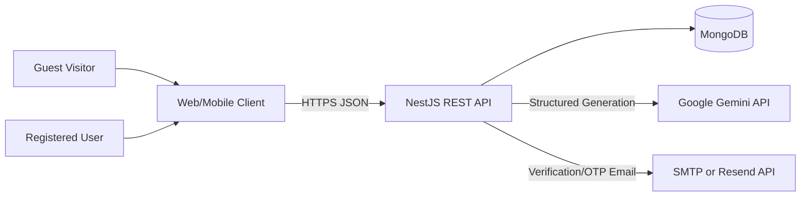

# Software Requirements Specification (SRS)

## AI Travel & Outing Planner Backend

| Attribute       | Value                      |
| --------------- | -------------------------- |
| Version         | 1.0                        |
| Status          | As-built specification     |
| Updated Date    | 2026-08-20                 |
| System          | `ai-travel-planner-server` |
| API Base Path   | `/api/v1`                  |
| Source Document | [PRD](./PRD.md)            |

## 1. Introduction

### 1.1. Purpose
This document specifies the software requirements for the AI Travel & Outing Planner backend service. It establishes the baseline for:
- Developers maintaining and extending system behavior.
- QA creating test suites and acceptance verifications.
- Product Owners cross-referencing business rules with technical implementations.
- DevOps configuring, deploying, and monitoring services.

### 1.2. Scope
The system provides a RESTful API covering:
- Identity, authentication, and session management.
- Email verification and password recovery.
- User profile management.
- AI travel itinerary generation using Google Gemini.
- Storage, pagination, access control, public sharing, and trip deletion.
- System health checks, DTO validation, rate limiting, CORS, and logging.

### 1.3. Keyword Conventions
- **MUST / SHALL**: Mandatory requirement.
- **SHOULD**: Recommended practice.
- **MAY**: Optional feature.
- **Anonymous / Guest**: Request without Bearer access token.
- **Authenticated User**: User with a valid Bearer access token.
- **Owner**: User whose `_id` matches the `userId` on a trip plan.
- **Access Token**: Short-lived JWT granting access to protected APIs.
- **Refresh Token**: Long-lived JWT used to obtain new access tokens or logout.

### 1.4. References
- [PRD](./PRD.md)
- [API Documentation](./API.md)
- [Project Structure](./STRUCTURE.md)
- [Environment Configuration](../.env.example)

## 2. Overall Description

### 2.1. System Context

### 2.2. Logical Architecture

| Layer / Module      | Responsibility                                                                   |
| ------------------- | -------------------------------------------------------------------------------- |
| `AppModule`         | App configuration, MongoDB connection, rate limiting, module orchestration       |
| `AuthModule`        | Auth controller, Passport strategies/guards, tokens, verification, password reset |
| `UsersModule`       | User entity data access, credentials, and profile management                     |
| `OtpModule`         | Generation, bcrypt hashing, validation, and cleanup of OTP codes                 |
| `TripPlannerModule` | AI generation, quota tracking, retrieval, sharing, and access control            |
| `MailModule`        | Email delivery via Resend HTTP API or Nodemailer SMTP                            |
| `GeminiAiService`   | Google GenAI SDK invocation, response parsing, and validation                    |
| `BaseRepository`    | Generic MongoDB CRUD abstraction pattern                                         |

### 2.3. User Personas & Actors

| Actor             | Description                                                            |
| ----------------- | ---------------------------------------------------------------------- |
| Guest             | Creates temporary plans and views public trips without an account      |
| Unverified User   | Registered user pending email verification; cannot login               |
| Active User       | Authenticated user with full access to private trips and profile       |
| Banned User       | Account disabled by moderation; denied authentication and token usage  |
| Gemini AI         | Generates structured JSON travel itineraries                           |
| Mail Provider     | Dispatches verification links and password recovery OTPs               |
| MongoDB           | Persistent datastore for users, OTPs, AI quotas, and trip plans        |
| CI Runner         | Executes linting, unit tests, E2E tests, and build checks              |

### 2.4. Access Control Matrix

| Feature                         |         Guest |          Unverified User |               Active User | Owner |
| ------------------------------- | ------------: | -----------------------: | ------------------------: | ----: |
| Register                        |           Yes |                      Yes |                       Yes |   Yes |
| Verify / Resend Email           |           Yes |                      Yes | Yes (resend no-op active) |   Yes |
| Login                           |           N/A |                   Denied |                       Yes |   Yes |
| Generate Plan                   |           Yes | Yes (as guest, no token) |                       Yes |   Yes |
| View Public Feed                |           Yes |                      Yes |                       Yes |   Yes |
| View Public Plan                |           Yes |                      Yes |                       Yes |   Yes |
| View Private Plan               |            No |                       No |             Own plan only |   Yes |
| Personal History (`my-trips`)   |            No |                       No |                       Yes |   Yes |
| Share / Delete Plan             |            No |                       No |             Own plan only |   Yes |
| Profile / Change Pass / Logout  |            No |                       No |                       Yes |   Yes |

## 3. Functional Requirements

### 3.1. Registration & Email Verification

#### FR-AUTH-001 – Account Registration
- Endpoint: `POST /api/v1/auth/register`.
- System MUST accept `email`, `username`, `password`, `name`.
- System MUST trim and lowercase the email address.
- System MUST reject duplicate emails or usernames with HTTP 409 Conflict.
- System MUST hash password using bcrypt before storage.
- New accounts MUST be created with `isActive = false`, `isBanned = false`, `role = user`.
- System MUST trigger verification email dispatch upon user creation.
- Response (201) MUST NOT contain access tokens, refresh tokens, or password hashes.

#### FR-AUTH-002 – Verification Email Dispatch
- System MUST generate a random UUID `jti` per dispatch.
- System MUST persist the bcrypt hash of `jti` in the user document (`verifyJti`).
- System MUST issue a signed JWT token of type `email_verify` containing `sub` and `jti`.
- Default expiration is 15 minutes unless overridden by `JWT_EMAIL_VERIFY_EXPIRE`.
- Verification link format: `{BACKEND_BASE_URL}/api/v1/auth/verify-email?token=<jwt_token>`.
- Email delivery MUST use Resend if `RESEND_API_KEY` is configured, otherwise Nodemailer SMTP.
- Email delivery failure MUST NOT roll back user registration.

#### FR-AUTH-003 – Email Verification Execution
- Endpoint: `GET /api/v1/auth/verify-email?token=<token>`.
- System MUST verify JWT signature, expiration, and `type = email_verify`.
- System MUST verify `jti` against the stored `verifyJti` bcrypt hash.
- System MUST atomically set `isActive = true`, `emailVerifiedAt = new Date()`, and unset `verifyJti`.
- Reused, outdated, or invalid tokens MUST return HTTP 400 Bad Request.

#### FR-AUTH-004 – Resend Verification Link
- Endpoint: `POST /api/v1/auth/resend-verification`.
- If email exists and account is inactive, system MUST generate and dispatch a new verification token.
- If email does not exist or account is already active, system MUST NOT send an email.
- Response MUST always be HTTP 202 with a neutral message to prevent account enumeration.

### 3.2. Authentication & Token Lifecycle

#### FR-AUTH-005 – User Login
- Endpoint: `POST /api/v1/auth/login`.
- System MUST validate email format and verify password with bcrypt.
- Inactive or banned accounts MUST be rejected.
- System MUST generate a refresh token with `sub`, `type = refresh`, `tokenVersion`, `role`.
- System MUST store the bcrypt hash of the refresh token in the user record.
- System MUST generate an access token with `sub`, `email`, `type = accessToken`, `role`, `tokenVersion`.
- Response (200) MUST return `access_token`, `refresh_token`, and sanitized user object.

#### FR-AUTH-006 – Access Token Refresh
- Endpoint: `POST /api/v1/auth/refresh`.
- Request header MUST contain `Authorization: Bearer <refresh_token>`.
- System MUST verify token signature, expiration, `type = refresh`, user status, and `tokenVersion`.
- Plaintext refresh token MUST match the bcrypt hash in database.
- On success, response (200) returns a new `access_token`.

#### FR-AUTH-007 – Token Revocation Mechanism
- On password change, password reset, or logout, system MUST increment `refreshTokenVersion`.
- Any existing access or refresh token with a stale version MUST be rejected on subsequent requests.
- Refresh token hash in database MUST be unset on logout or password alteration.

#### FR-AUTH-008 – User Logout
- Endpoint: `DELETE /api/v1/auth/logout`.
- Request header MUST contain a valid Bearer refresh token.
- System MUST unset the refresh token hash and increment `refreshTokenVersion`.

### 3.3. Profile & Password Management

#### FR-USER-001 – View Profile
- Endpoint: `GET /api/v1/auth/profile`.
- Requires valid Bearer access token.
- Response MUST NOT include password, refresh token, `verifyJti`, or internal authentication flags.

#### FR-USER-002 – Update Profile
- Endpoint: `PATCH /api/v1/auth/profile`.
- Allows updating `gender`, `phone`, `name`, `avatarUrl`, `bio`, `birthDate`.
- Whitelist validation MUST strip or reject unknown fields.
- Email, username, role, and active status MUST NOT be editable via this endpoint.

#### FR-USER-003 – Change Password (Authenticated)
- Endpoint: `PATCH /api/v1/auth/change-password`.
- Requires valid access token.
- `oldPassword` MUST match current password.
- `newPassword` MUST match `confirmPassword` and meet length requirements (8–20 chars).
- Upon success, all existing tokens across all devices MUST be revoked.

### 3.4. Password Recovery Flow

#### FR-RESET-001 – Request Password Reset OTP
- Endpoint: `POST /api/v1/auth/forgot-password`.
- Always returns HTTP 202 with a neutral message.
- If user exists, generates a 6-digit numeric OTP (100000–999999).
- OTP MUST be bcrypt-hashed prior to database storage.
- Previous unused OTPs for the same user and purpose MUST be purged.
- Default OTP TTL is 5 minutes.

#### FR-RESET-002 – Verify Password Reset OTP
- Endpoint: `POST /api/v1/auth/forgot-password-verify`.
- Validates 6-digit OTP against the latest active unexpired record.
- Upon successful match, marks OTP as `used = true`.
- Response (200) returns a short-lived `reset_token` (signed JWT).

#### FR-RESET-003 – Execute Password Reset
- Endpoint: `PATCH /api/v1/auth/change-password-forgot`.
- Validates `resetToken` signature, expiration, and matching `tokenVersion`.
- Updates password hash, increments `refreshTokenVersion`, and unsets refresh token.
- Reset token cannot be reused as `tokenVersion` has changed.

### 3.5. AI Trip Planner

#### FR-TRIP-001 – Generate Trip Plan Request
- Endpoint: `POST /api/v1/trip-planner/generate`.
- Supports both authenticated users and anonymous guests via `OptionalJwtAccessGuard`.
- Validates input criteria against budget limits (100,000–1,000,000,000 VNĐ), people count (1–100), days (1–14), and nights.

#### FR-TRIP-002 – Budget Normalization
- If `budgetType = per_person`, total group budget is calculated as `budget × numberOfPeople`.
- Prompt incorporates both total group budget and per-person breakdown.

#### FR-TRIP-003 – Google Gemini Structured Output
- Default model: `gemini-3.5-flash-lite` (configurable via `GEMINI_MODEL`).
- Requests JSON mode with full JSON Schema definition.
- Enforces request timeout (default 25s).

#### FR-TRIP-004 – AI Response Post-Validation (Zod)
- Parses JSON output and validates via Zod schema.
- Verifies exact matching day count (`itinerary.length === days`).
- Verifies `totalEstimated <= maximumBudget`.
- Verifies budget component sums match `totalEstimated` within allowable 5% tolerance.
- Verifies per-person cost matches `totalEstimated / numberOfPeople` within tolerance.

#### FR-TRIP-005 – Persistence & Guest Management
- User plan: saved with `userId = ObjectId`, `isPublic = false`, `expiresAt = null`.
- Guest plan: saved with `userId = null`, `isPublic = false`, `guestTokenHash = bcrypt(guestManageToken)`, `expiresAt = now + TTL`.
- Returns `guest_manage_token` once to the guest client.
- Response serializer removes `userId` and `guestTokenHash`.

#### FR-TRIP-006 – Trip History, Sharing, and Claiming
- `GET /api/v1/trip-planner/my-trips`: Paginated history of authenticated user.
- `GET /api/v1/trip-planner/public`: Paginated public itineraries.
- `GET /api/v1/trip-planner/:id`: Detailed view (public, owner with JWT, or guest with `X-Guest-Token`).
- `POST /api/v1/trip-planner/:id/claim`: Transfers guest plan to user account using `X-Guest-Token`.
- `PATCH /api/v1/trip-planner/:id/share`: Toggles public sharing (owner only).
- `DELETE /api/v1/trip-planner/:id`: Deletes plan (owner or guest with token).
- `GET /api/v1/trip-planner/quota`: Returns remaining AI calls (20/day for users, 5/day for guests).

### 3.6. System & Infrastructure

#### FR-SYS-001 – Health Check
- Endpoint: `GET /api/v1/health`.
- Reports MongoDB connectivity status, Gemini API key configuration status, and timestamp.

#### FR-SYS-002 – Swagger Documentation
- Endpoint: `GET /api/v1/docs` (OpenAPI specification at `/api/v1/docs/openapi.json`).

## 4. Non-Functional Requirements

### NFR-001 – Performance & Latency
- Non-AI API endpoints: P95 ≤ 1s under normal load.
- AI Generation: P95 ≤ 30s (governed by Gemini API latency).
- Database indexes configured for fast sorting and TTL cleanup.

### NFR-002 – Security & Data Integrity
- Helmet middleware enabled for security HTTP headers.
- CORS restricted to configured origins in production.
- Rate limiting applied globally and with strict throttle limits on auth endpoints.
- AI daily quotas tracked atomically in MongoDB via HMAC-SHA256 hashed identifiers.

### NFR-003 – Maintainability & Code Quality
- Clean Architecture with high cohesion and low coupling.
- Strong TypeScript typing without `any` in production services.
- 100% passing Unit tests and E2E test suites on CI.

## 5. Environment Variables Reference

| Variable                      | Required               | Default                 | Purpose                                  |
| ----------------------------- | ---------------------- | ----------------------- | ---------------------------------------- |
| `MONGODB_URI`                 | Yes                    | -                       | MongoDB connection string                |
| `JWT_ACCESS_SECRET`           | Yes (min 32 chars)     | -                       | Signs access tokens                      |
| `JWT_REFRESH_SECRET`          | Yes (min 32 chars)     | -                       | Signs refresh tokens                     |
| `JWT_EMAIL_VERIFY_SECRET`     | Yes (min 32 chars)     | -                       | Signs email verification tokens          |
| `JWT_RESET_PASSWORD_SECRET`   | Yes in Prod            | Fallback to access sec  | Signs password reset tokens              |
| `BACKEND_BASE_URL`            | Yes                    | -                       | Backend base URL for verify links        |
| `FRONTEND_URL`                | Yes in Prod            | -                       | Allowed CORS origin                      |
| `GEMINI_API_KEY`              | Yes in Prod            | -                       | Google Gemini API key                    |
| `GEMINI_MODEL`                | No                     | `gemini-3.5-flash-lite` | Gemini model name                        |
| `AI_DAILY_USER_LIMIT`         | No                     | 20                      | Daily generation limit per user          |
| `AI_DAILY_GUEST_LIMIT`        | No                     | 5                       | Daily generation limit per guest IP      |
| `GUEST_PLAN_TTL_HOURS`        | No                     | 72                      | Guest plan retention period (hours)      |
| `EXTERNAL_REQUEST_TIMEOUT_MS` | No                     | 25000                   | External HTTP / Gemini timeout (ms)      |
| `MAIL_FROM`                   | Yes in Prod            | -                       | Sender email address                     |
| `RESEND_API_KEY`              | Optional               | -                       | Resend API key for email delivery        |
| `MAIL_HOST`, `MAIL_PORT`, ... | Optional               | -                       | SMTP configuration for email delivery    |
